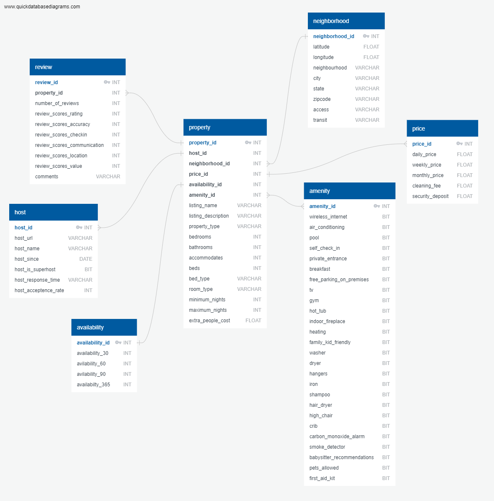

 # Airbnb in Los Angeles
​
By Andrew McGraw, Maryam Tabatabaei, Cade Schkerke, Qixuan Wang, Karly Ringstad, and Nathanuel Martin 

​

# What is Airbnb?
  
Airbnb is a vacation rental online marketplace that was founded in 2007 by roommates who had extra space in their high price San Francisco apartment and needed a way of offsetting their rent. This website connects vacationers and travelers searching for short-term stays with the appropriate available properties, acting as a liaison between hosts and guests. In return, Airbnb collects a percentage of the rental price as a fee for its services. 

Users of the website are able to filter preferences by lodging type, date, location, price, and more. There is also the option to directly contact a host in the messaging portion of the platform. Hosts can set specific guidelines for their properties, such as number of allowed guests, rules, and cleaning terms. One interesting aspect about Airbnb is that not only can guests leave reviews, but hosts can also leave reviews about their guests in order to provide insight for other hosts about prospective renters. Airbnb has grown from one miniscule west coast apartment to a multibillion-dollar enterprise.
  
  
# Objective
The goal of our project was to utilize supervised and unsupervised machine learning models in order to explore possible relationships between variables found within our dataset pertaining to Los Angeles Airbnb information. We also aimed to create a variety of visualizations and interactive dashboards to illustrate our findings.

Questions we aimed to explore:
* Which neighborhood is the least/most expensive in LA?​
* How is price impacted by reviews (NLP), room types, host, and neighborhood? ​
* How do offered amenities influence price?​

# Dataset

We have totally 7 datasets for our project. They all could be downloaded from the AWS S3.

Here are the AWS bucket links to the datasets:

1. [Amenity](https://data-analytics-airbnb.s3.us-east-2.amazonaws.com/Data/amenity.csv)
2. [Availability](https://data-analytics-airbnb.s3.us-east-2.amazonaws.com/Data/availability.csv)
3. [Host](https://data-analytics-airbnb.s3.us-east-2.amazonaws.com/Data/host.csv)
4. [Neighborhood](https://data-analytics-airbnb.s3.us-east-2.amazonaws.com/Data/neighborhood.csv)
5. [Price](https://data-analytics-airbnb.s3.us-east-2.amazonaws.com/Data/price.csv)
6. [Property](https://data-analytics-airbnb.s3.us-east-2.amazonaws.com/Data/property.csv)
8. [Review](https://data-analytics-airbnb.s3.us-east-2.amazonaws.com/Data/review.csv)
  
# Data Exploration
Original source: [Kaggle](https://www.kaggle.com/oindrilasen/la-airbnb-listings)​
 
Current Sources: [Inside Airbnb](http://insideairbnb.com/get-the-data.html), 
                 [Review Table](https://data-analytics-airbnb.s3.us-east-2.amazonaws.com/Data/reviews.csv)

Throughout our data exploration, we discovered a variety of variables to examine and determine whether relationships between anya re present. 
Variable Examples include:
* Price​
* Neighborhood​
* Amenities​
* Room-Type​
* Guest Accommodation​

# ERD
   

Our web application utilizes:
* A postgreSQL database in AWS
* Python for ETL 
*
*
* FLASK API to render data from the database to the front-end application
* HTML/JS/CSS using GeoJSON, Choropleth Leaflet, Bootstrap, and Tableau for the webpage and visualizations
* Heroku cloud platform for app deployment 

# Machine Learning Models
##Latent Dirichlet Allocation(LDA)

LDA is an example of topic modeling that used to classify text in a document. We used it to find patterns in comments column of Airbnb dataset for LA.

1. Preprocessing

 * Tokenization is used to split the text into sentence and sentence into words, also turning the words into lower case, and remove punctuations.
 * Stopwords were removed
 * Lemmatization , thrird person changed to first person. Verbs in past and present tenses turned into present tense.
 * Words were stemmed to its roots.

2. Loading gensim and nltk 

3. Wrrote a function to perform lemmatization and stem preprocessing.

4. Select a document to preview

5. Turning the bag of words into dictionary and find the frequency that a certain words were appeared in training set.

6. TD_IDF

7. Running LDA using bag of words for each topic and explore words occuring in that topic and it's relative weight.

##Naive Bayse

Naive bayes is a predictive modeling problem that involves assigning a given input data to a sample. In this project, we are trying to calculate the conditional probablity of a class label for review_scores_rating given the airbnb data sample for LA. In other words, we used Naive Bayes to classify review scores based on comments provided by guests.

### Classifying Comments for Naive_Bayes Modeling of Airbnb

1. Read in the file from AWS and fix the data structure in pyspark using structtype.

2. Created a column that adds the length of the review as a feature.

3. Created a list of transformations to be applied in the pipeline:

   * Created label column that will be used later for predicting by transforming review_scores_rating into 4 bins with rating 0 to 40 as 1, 41 to 70 as 2 and 70 to 100 as 3, using bucketizer. Now we have a label column with 1, 2 and 3.

   * We used langdetect to only pick the enlish comments for the analysis to be used for stop words dictionary later.	
      ** We utilized a user defined function (udf) to transform langdetect function.

   * Tokenize the review.

   * Removed the punctuation and exclamation from the comments.

   * Filter out stop words.

   * Calculate term frequency using `HashingTF`.

   * Calculate TF–IDF.

4. Create a feature vector containing the output from the IDFModel and the length.

   * Fit it to the data.

   * Create training and testing data of 0.8 , and 0.2.

   * Create and fit the Naive Bayes model to the training data.

   * Predict outcomes using the testing set.

   * Used `MulticlassClassificationEvaluator` to evaluate the model on the testing set, Accuracy of model at predicting reviews was: 0.997703.

##XGBoost

A model known for getting high levels of accuracy in machine learning models without doing much tuning, and agile performance.
Boosting works in such a way that many different decision trees are built. Each of these individual trees work to provide some vital piece of information for prediction, despite not being strong individually. The whole is worth more than the sum of its parts, so to speak. 

This is the fundamental concept of the boosting technique: Leveraging many different weak learners for their most useful parts, and “boosting” them for optimal performance. Each tree learns and updates residual errors, then “grows the next tree” based on this updated residual error. The final, now strong, learner decreases the bias and variance of the model. The result is many small trees that are not very deep. A few of the validation techniques of the model are k-fold cross validation and Mean Standard Error. With such large numbers of trees, there is risk of overfitting.  There must be carefully chosen stop criteria for the boosting process.
​
# Visualizations

* Tableau Dashboard Links:

1. [Dashboard](https://public.tableau.com/views/AirbnbDashboard_15948743321440/AirbnbDashboard?:language=en-GB&:display_count=y&publish=yes&:origin=viz_share_link)

2. [Airbnb_LA](https://public.tableau.com/views/Airbnb_LA/Dashboard1?:language=en&:display_count=y&publish=yes&:origin=viz_share_link)

# Conclusions

Based on predictions from our models and visualizations:​

1. The most expensive neighborhoods to rent in are Bel-Air and Harbor City at $1300/night, and the least expensive is Huntington Park at $19/night.​

2. Desirable neighborhoods have higher average prices, and the longer a person has been registered as a host, the higher the rental price. ​ 

3. Amenities tend to influence overall price. Indoor fireplaces have the largest pricing influence followed by hot tubs. 

# Webpage  
Click [here](https://airbnb-machine-learning.herokuapp.com/tableau) to Deploy the Heroku app.
